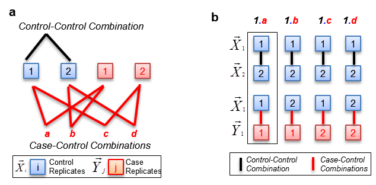
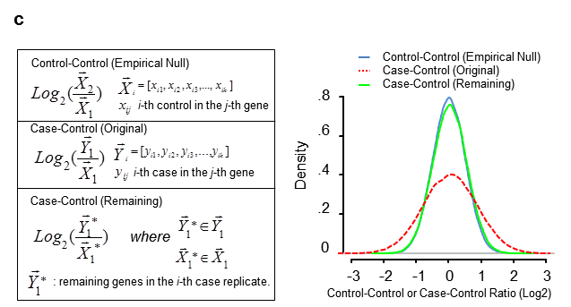
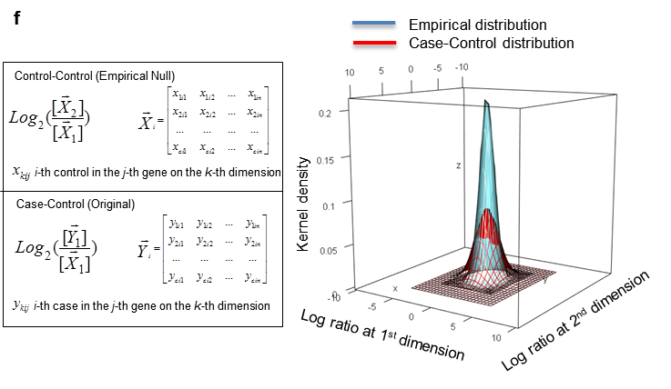
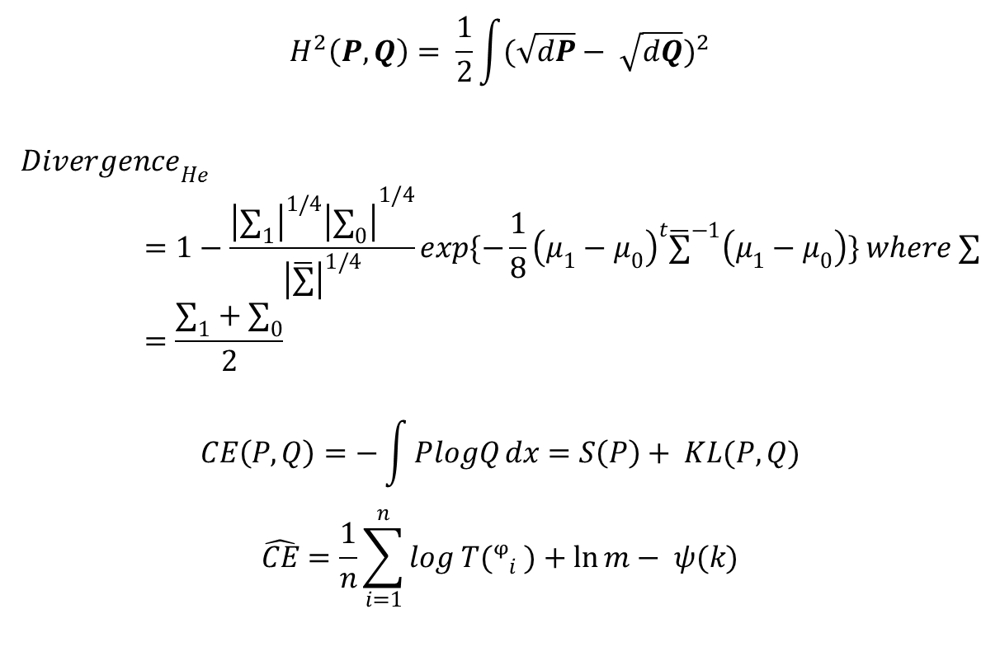

<!--
%% \VignetteEngine{knitr::rmarkdown}
%\VignetteIndexEntry{fCI}
-->


#  Introduction to fCI

##  Authors and Affliations

Shaojun Tang1, Martin Hemberg2, Ertugrul Cansizoglu3, Stephane Belin3, Kenneth Kosik4, Gabriel Kreiman2, Hanno Steen1#+, Judith Steen3#+

1Departments of Pathology, Boston Childrens Hospital and Harvard Medical School, Boston, MA, USA, 02115

2Department of Ophthalmology, Boston Childrens Hospital, Boston, MA, USA, 02115

3F.M. Kirby Neurobiology Center, Childrens Hospital, and Department of Neurology, Harvard Medical School, 300 Longwood Avenue, Boston, MA, USA, 02115

4Neuroscience Research Institute, University of California at Santa Barbara, Santa Barbara, CA, USA, 93106"

##  Abstract

"The ability to integrate 'omics' (i.e., transcriptomics and proteomics) is becoming increasingly important to understanding regulatory mechanisms. There are currently no tools available to identify differentially expressed genes (DEGs) across different 'omics' data types or multi-dimensional data including time courses. We present a model capable of simultaneously identifying DEGs from continuous and discrete transcriptomic, proteomic and integrated proteogenomic data. We show that our algorithm can be used across multiple diverse sets of data and can unambiguously find genes that show functional modulation, developmental changes or misregulation. Applying our model to a time course proteogenomics dataset, we identified a number of important genes that showed distinctive regulation patterns.

##  Introduction

 fCI (f-divergence Cutoff Index), identifies DEGs by computing 
the difference between the distribution of fold-changes for the control-control 
and remaining (non-differential) case-control gene expression ratio data.As a null hypothesis, we assume that the control samples, regardless of data types, do not contain DEGs and that the spread of the control data reflects the biological and technical variance in the data. In contrast, the case samples contain a yet unknown number of DEGs. Removing DEGs from the case data leaves a set of non-differentially expressed genes whose distribution is identical to the control samples. Our method, f-divergence cut-out index (fCI) identifies DEGs by computing the difference between the distribution of fold-changes for the control-control data and remaining (non-differential) case-control gene expression ratio data (see Fig. 1.a-b) upon removal of genes with large fold changes




fCI provides several
advantages compared to existing methods. Firstly, it performed equally well or 
better in finding DEGs in diverse data types (both discrete and continuous data)
from various omics technologies compared to methods that were specifically 
designed for the experiments. Secondly, it fulfills an urgent need in the 
omics research arena. The increasingly common proteogenomic approaches enabled
by rapidly decreasing sequencing costs facilitates the collection of 
multi-dimensional (i.e. proteogenomics) experiments, for which no efficient 
tools have been developed to find co-regulation and dependences of DEGs
between treatment conditions or developmental stages. Thirdly, fCI does not 
rely on statistical methods that require sufficiently large numbers of 
replicates to evaluate DEGs. Instead fCI can effectively identify changes in 
samples with very few or no replicates.


#  Installing fCI

fCI should be installed as follows:

```{r eval=FALSE}
source("http://bioconductor.org/biocLite.R")
biocLite("fCI")
```
```{r, warning = FALSE, message = FALSE}
 suppressPackageStartupMessages(library(fCI))
 library(fCI)
```


#  Differential Expression Analysis using fCI

fCI is very usefriendly. Users only need to provide a 'Tab' delimited
 input data file and give the indexes of control and case samples.

##  Reading the input data:

Read Inupt Data to R** . This input will contain gene, protein or other 
expression values with columns representing samples/lanes/replicates, and
rows representing genes. 

###  Integer raw read counts from NGS data or Spectrum counts from proteomics data
  
As input, the fCI package could analysis count data as obtained, e. g., from RNA-seq or another high-throughput sequencing experiment, in the form of a matrix of integer values. The value in the i-th row and the j-th column of the matrix tells how many reads have been mapped to gene i in sample j. Analogously, for other types of assays, the rows of the matrix might correspond e. g. to binding regions (with ChIP-Seq) or peptide sequences
(with quantitative mass spectrometry). 
  
###  Normalized gene expression such as RPKM or FPKM, or peak intesntiy (height/area) in proteomics data

The fCI package could also analyze decimal data in the form of RPKM/FPKM from RNA-seq or another high-throughput sequencing experiment, in the form of a matrix of integer values. The value in the i-th row and the j-th column of the matrix tells the normalized expression level in gene i and sample j. 

###  Ratio data from many experiments measuring relative gene expression with respect to control channels.

For example, relative protein quantification by MS/MS using the tandem mass tag technology are represented by ratios. 

##  Data normalization

###  Total library normalization

The samples are normalized to have the same library size (i.e. total raw read counts) if the experiment replicates were obtained by the same protocol and an equal library size was expected within each experimental condition. The fCI will apply the sum normalization so that each column has equal value by summing all the genes of each replicate.

```{r}
fci.data=data.frame(matrix(sample(3:100, 1043*6, replace=TRUE), 1043,6))
fci.data=total.library.size.normalization(fci.data)
```

###  Trimed sum normalization

We could normalize each replicate to have the same library size (total read count) after the 5% lowly expressed and the 5% highly expressed genes were removed from each replicate

```{r}
fci.data=data.frame(matrix(sample(3:100, 1043*6, replace=TRUE), 1043,6))
fci.data=trim.size.normalization(fci.data)
```

###  Kernel density distribution centering

We hypothesized that the genes whose expression was the least affected by the experiment (in the forms of both RNA and protein) should have nearly identical expression levels across different replicates, in both RNA-Seq and proteomic datasets. These unchanged genes will be centered at zero in the logarithm transformed control-control or case-control ratio distributions. Therefore, we normalized proteogenomic dataset's fCI pairwise ratio distribution (Gaussian kernel density approximation) to be centered at zero.


##  fCI analysis with the Spike-in microarray data
* **The Spike-in data** contained a number of spiked-in differentially expressed
 genes with a known cutoff of 1.4 fold threshold.

* The input data is a tab-delimited file with rows representing genes and columns
being the samples of control and experimental treatments. T

* To find the DEGs, we first created a fCI class object named fci, which will be
passed onto the main function "find.fci.targets". In the function call, the users
need to specify the control sample column ids (such as a vector of 1, 2 and 3) and 
case sample column ids (such as a vector of 4, 5 and 6). Each sample must contain 
the same number of genes. 

* For the chosen control samples, fCI forms a list of the control-control 
combinations, namely 1-2, 1-3 and 2-3, each containing two unique replicates from 
the full set of control replicates. Similarly, fCI forms a list of control-case 
combinations, namely, 1-4, 1-5, 1-6, 2-4, 2-5, 2-6, 3-4, 3-5 and 3-6, each containing 
a unique replicate from the control and a unique replicate from the case samples.  

```{r}
  
pkg.path=path.package('fCI')
filename=paste(pkg.path, "/extdata/Supp_Dataset_part_2.txt", sep="")

if(file.exists(filename)){
  fci=new("NPCI")
  fci=find.fci.targets(fci, c(1,2,3), c(4,5,6), filename)
}

```


##  fCI DEG analysis Output

* the returned object 'fci' will contains all the differentially expressed genes 
and runtime variables, including the DEGs and kernel density distributions.

###  Print Differentially Expressed Genes

```{r}
  Diff.Expr.Genes=show.targets(fci)
  head(Diff.Expr.Genes)
```

* The output will be the genes that are differentially expressed and have 
been reported at more than 50% of the internal fCI pairwise analyses.For 
example,  A probability score of 0.75 means the gene under study is shown
to be a dysregulated target in 3 out of 4 fCI pairwise analysis.

* As fCI is coded using object oritented programming, all computations are 
based on object manipulation. 


###  The Kernel Density Plot of Control-Control and Control-Case distributions

```{r}
  figures(fci)
```


* **The kernel density plot** shows the distribution of logarithm ratios in the
 control-control dataset and case-control dataset. In general, the control-
 control distribution should reflects the system noise while the case-control
 will contains real DEGs and system noises.
 

* Instead of using all control and case samples, the user could specify a small  
  sample and perform a pilot study. This is extremely useful if the users are
  only interested on a small subset of samples.

```{r}
  fci=find.fci.targets(fci, c(1,2), 5, filename)
```

##  Alternative function to find DEGs 

* Using the same microarray dataset, we could run fCI with a single function call.
However, the internal runtime variables and fci object will disappear after the 
function returns.

```{r}
if(file.exists(filename)){
  Diff.Expr.Genes=fCI.call.by.index(c(1,2,3), c(4,5,6), filename)
  head(Diff.Expr.Genes)
}
```


##  Testing fCI on a randomly generated simulated dataset

* In this example, we generated a simulated random dataset with 3 control 
replicates (column 1 through 3) and 3 case replicates (columns 4 through 6).

```{r, results='asis'}
fci.data=data.frame(matrix(sample(3:100, 1043*6, replace=TRUE), 1043,6))
```

###  Finding Differentially Expressed Genes (no DEGs in this case):

* **To identify differentially expressed genes** using the above simulated data:

```{r, warning = FALSE, message = FALSE}
 library(fCI)
 fci=new("NPCI")
 targets=find.fci.targets(fci, c(1,2,3), c(4,5,6), fci.data)
 Diff.Expr.Genes=show.targets(targets)
 head(Diff.Expr.Genes)
 figures(targets)
```

* fCI didn't find a local minimum divergence under the given cutoff fold changes. 
 This confirms that there is indeed no differentially expressed genes.
 
* This analysis strongly proved that fCI is able to distinguish real DEGs from
system noise. If the distribution of case-control didn't show obivous deviation
from control-control, no DEGs will be reported.


#  Multi-dimensional (i.e.Pproteogenomics data) fCI analysis 

* If the dataset contains multiple control replicates and 
case replicates, the users don't need to form the these 
combinations and perform fCI individually. Instead, users 
could invoke fci on a top-level function that will 
automatically perform the analysis on given control
replicate column ids and case/experimental column ids.

Formation of empirical & experimental distributions on 
integrated and/or multidimensional (i.e. time course data).
In this example, gene expression values are recorded at c 
dimensions (c=2 in this figure) with m replicates at each 
condition from a total of n genes. The ratio of the chosen 
fCI control-control (or control-case) on 2-dimensional 
measurements will undergo logarithm transformation and 
normalization for the analysis. If the pathological
or experimental condition causes a number of genes to 
be up-regulated or down-regulated, a wider distribution
which can be described by kernel density distribution 
(indicated by the 3D ellipse in red) compared to the 
control-control empirical null distribution (indicated 
by the 3D ellipse in blue) will be observed. fCI then 
gradually removes the genes from both tails 
(representing genes having larger fold changes) from
both dimensions using the Hellinger Divergence or 
Cross Entropy estimation (see methods and materials) 
until the remaining case-control distribution is very
similar or identical to the empirical null distribution, 
as indicated by the kern density distribution



##  Example of integrated proteogeonomics analysis

* Given a dataset with gene expression measured in control,
 treatment-1 and treatment-2 in both proteomics and 
 transcriptomics data. If the user want to see the 
 co-regulated genes in treatment-1 with respect to control
 in both proteomics and transcriptomics data. The users 
 just need to indicate the control and experimental samples
 for both data type respective. For example

```{r}
fci=new("NPCI")
filename2=paste(pkg.path, "/extdata/proteoGenomics.txt", sep="")
if(file.exists(filename2)){
  targets=find.fci.targets(fci, list(1:2, 7:8), list(5:6, 11:12),
                       filename2)
  Diff.Expr.Genes=show.targets(targets)
  head(Diff.Expr.Genes)
}
```

* In this example, the control ids are a list of two independent
  sample ids. Column 1 and 2 are samples of control proteomics data, 
  and column 7 and 8 are samples of control transcriptomics data. 
  Similarily, Column 5 and 6 are samples of case proteomics data, 
  and column 11 and 12 are samples of case transcriptomics data.  
  
* In other words, the users simply need to give a list of independent
  control sample ids, and another list of independent case sample
  ides during the multidimensional analysis. 
  
* The original proteogenomics dataset are indicated in the following

```{r}
proteogenomic.data=read.csv(filename2, sep="\t")
head(proteogenomic.data)
```

##  Specifying fCI runtime variables

* The users can set a variety of fCI, including the control samples, 
case samples, the predefined fold change cutoff values, and specifiy
whether to center the distribution by kernel density or not.

```{r}
fci=new("NPCI")
fci=setfCI(fci, 7:8, 11:12, seq(from=1.1,to=3,by=0.1), TRUE)
```

##  Use only transcriptomics dataset in the proteogenomics data

* Using the same proteogeonomics data, if the user only want 
  to see the differentially expressed genes of treament-1 in 
  transcriptomics only. The unction call becomes:
  
```{r}
if(file.exists(filename2)){
  fci=find.fci.targets(fci, 7:8, 11:12, filename2)
  head(show.targets(fci))
}
figures(fci)
```

#  Theory behind fCI

Our method considers transcriptomic (e.g. RPKM values from mapped reads of RNA-Seq experiment) and/or proteomic (e.g. protein peak intensities from TMT LC-MS/MS) data from two biological conditions (e.g. mutant and wild-type or case and control). The goal is to identify the set of genes whose RNA and/or protein levels are significantly changed in the case compared to the control. 

In the basic scenario, we require each condition to have two replicates (e.g., RNA, protein or integrated RNA & protein expression data). To identify a set of DEGs in the case samples, the fCI method compares the similarity between the distribution of the case-control ratios (subject to logarithm transformation), denoted P, and similarly the control-control ratios (the empirical null), denoted Q (see Fig 1.c and Supplementary Pseudocode). By construction, Q represents the empirical biological noise, i.e. the ratios from repeated measurements of the same sample. Under mild assumptions, the Almost Sure Central Limit Theorem ensures that P and Q will converge to a univariate/multivariate normal for large sample sizes. 

Similarly, we could also construct distributions of P and Q from integrated/multi-dimensional data. In the simplest scenario of a time-course study consisting of two case and control replicates recorded at two time points, the empirical distribution P will be a matrix of two column vectors representing the technical noises, and Q will be a second matrix with case-control ratios, both measured at two time points respectively. 
 
To identify DEGs, we consider the difference between the distributions P and Q as quantified by the f-divergence. The f-divergence is a generalization of the Kullback-Leibler divergence, the Hellinger distance, the total variation distance and many other ways of comparing two distributions based on the odds ratio. Currently, we have implemented two different instances of f-divergence, but it is straightforward to extend the fCI code by adding additional divergences.

The Hellinger distance, H, is one of the most widely used metrics for quantifying the distance between two distributions. The Hellinger distance has many advantageous properties such as being nonnegative, convex, monotone, and symmetric (24, 25)(22, 23). To calculate the Hellinger distance, we first use the Maximum Likelihood Estimate(MLE) to obtain the parameters of the distributions P and Q assuming Gaussian distributions. The distance between two Gaussian distributions becomes:




If we divide the case-control ratio data into differential and non-differential genes, the remaining non-differential genes (upon the removal of DEGs) from the case-control data should be drawn from the same distribution as the empirical null (7). Therefore, the divergence will be at a global minimum close to 0. 

When multiple biological/technical replicates are considered, the control-control ratio and case-control ratio can be formed in pair by mathematical combinations (see Fig 1.b). Otherwise, if replicates are not available for control data, P and Q will be the direct logarithm-transformed distribution of the original gene expression. fCI uses Hellinger distance by default. Empirically, we have found that the cross entropy approach provides more conservative results compared to the Hellinger distance.


